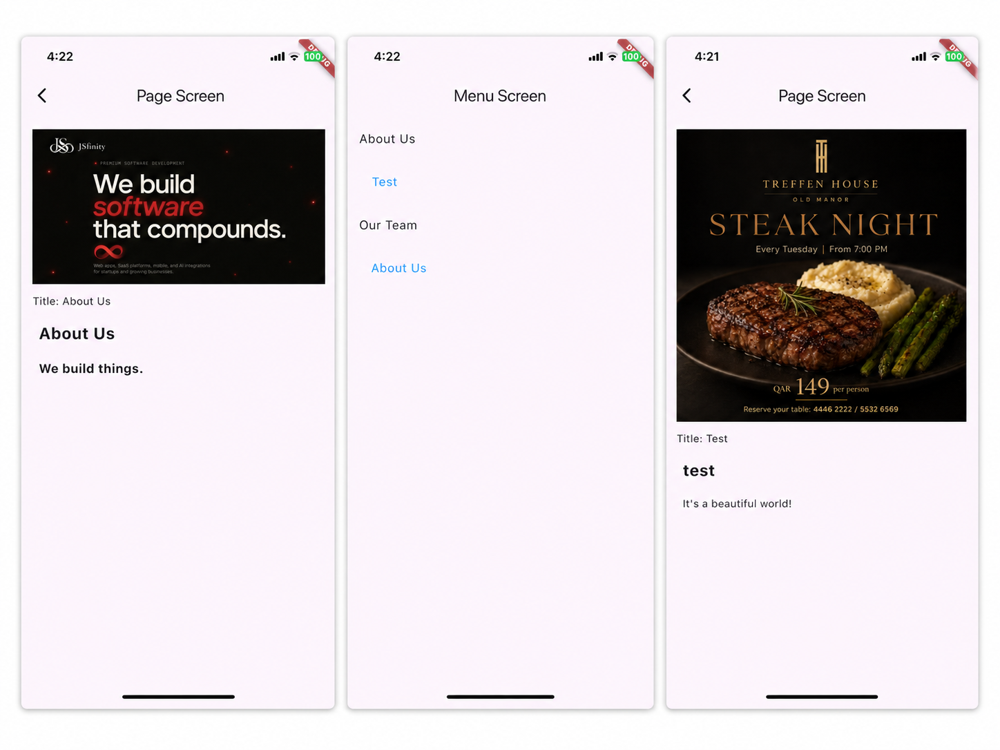

# CMS

Flutter client for browsing CMS's public content — menu tree and individual pages.

## What it does

- Fetches the site's menu tree (`/api/v1/public/menu`) and renders it recursively.
- Tapping a page link loads that page (`/api/v1/public/pages/{slug}`) and shows its cover image, title, and body rendered properly rather than dumped as raw markup.
- Handles loading and error states for both screens.

## Stack

- **Dio** for the HTTP client
- **Riverpod** (`FutureProvider` / `FutureProvider.family`) for fetching and caching the menu and page data
- **flutter_html** for rendering page body content
- Plain `Navigator`

## Running it

```
flutter pub get
flutter run
```

The API base URL is set in `lib/core/api/api_client.dart`

## Screenshots

Screens:


